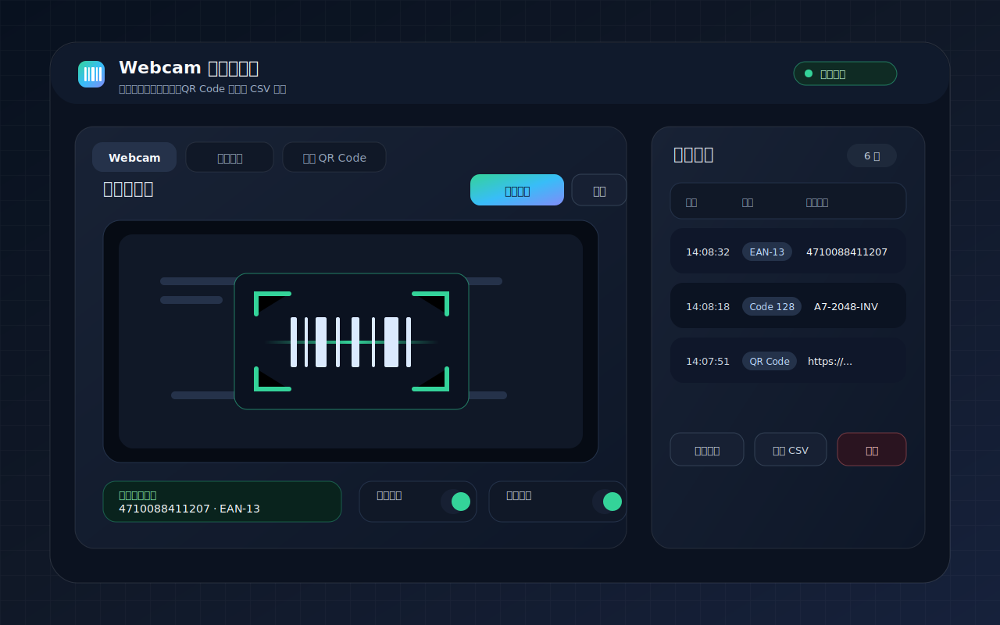

# 📷 Webcam 條碼掃描器

> 使用電腦 Webcam 即時掃描條碼，也支援圖片解析、QR Code 產生、掃描紀錄管理與 CSV 匯出。專案已改為本機字型與 PWA 離線優先配置，適合內部工具或課堂實作使用。



---

## 功能特色

| 功能 | 說明 |
| --- | --- |
| 即時掃描 | 開啟 Webcam 後自動偵測畫面中的條碼 |
| 圖片解析 | 支援拖放、選檔或貼上圖片進行條碼解析 |
| QR Code 產生 | 可輸入文字或網址並下載 QR Code 圖片 |
| 掃描紀錄 | 每筆結果包含時間、格式與條碼內容 |
| 重複過濾 | 可自動略過已掃描過的條碼 |
| CSV 匯出 | 匯出含 UTF-8 BOM 的 CSV，Excel 開啟不亂碼 |
| PWA 支援 | 使用 `/barcode-scanner/` base，可安裝並快取必要資產 |
| 本機 Google Fonts | Inter 與 Noto Sans TC 已下載為內部預設，不依賴外部字型 CDN |

## 支援格式

- Code 128
- Code 39
- EAN-13 / EAN-8
- UPC-A / UPC-E
- ITF
- Codabar
- QR Code

---

## 快速開始

### 前置需求

- Node.js 20+
- Chrome 或 Edge
- 電腦需配備 Webcam

### 安裝與啟動

```bash
npm install
npm run dev
```

預設開發網址：

```text
http://localhost:5173/barcode-scanner/
```

如果本機 `5173` 已被占用，可讓 Vite 自動切到下一個可用 port，再使用終端機顯示的網址。

---

## 使用方式

1. 進入 `Webcam` 分頁，點擊「開始掃描」並允許瀏覽器使用攝影機。
2. 將條碼放到掃描框中央，保持光線充足並避免反光。
3. 掃描成功後，結果會出現在最新掃描區與右側紀錄表。
4. 可使用「複製全部」或「匯出 CSV」取出資料。
5. 若條碼在圖片中，可切到「圖片掃描」分頁，拖放、選擇或貼上圖片。
6. 若需要建立 QR Code，可切到「產生 QR Code」分頁輸入文字後下載圖片。

## 掃描建議

- 條碼距離鏡頭約 10 到 20 公分通常較容易辨識。
- 條碼盡量保持水平，避免過度傾斜。
- 霧面紙張通常比反光材質更穩定。
- 若使用手機瀏覽器，請用 HTTPS 或可信任的本機環境，否則攝影機權限可能受限。

---

## 開發指令

```bash
npm run dev              # 啟動開發伺服器
npm run build            # type-check 後產出 production build
npm run preview          # 預覽 production build
npm run type-check       # TypeScript 型別檢查
npm run lint             # ESLint 檢查，警告視為失敗
npm run lint:fix         # ESLint 自動修復
npm run fonts:download   # 重新下載並裁切本機 Google Fonts
```

需要完整 Google Fonts 子集時可執行：

```bash
npm run fonts:download -- --full
```

---

## 專案結構

```text
barcode-scanner/
├── docs/assets/              文件與 README 視覺素材
├── public/                   PWA icon、分享圖與公開靜態資產
├── scripts/                  專案維護腳本
├── src/assets/fonts/         本機 Google Fonts woff2
├── src/core/                 掃描引擎、圖片解析、條碼格式映射
├── src/state/                掃描紀錄 store
├── src/styles/               design tokens、layout、元件樣式
└── src/ui/                   DOM refs、掃描 UI、結果表、匯出、toast
```

## 優化重點

- 掃描格式集中在 `src/core/barcode-formats.ts`，避免多處維護。
- 即時掃描 loop 使用固定間隔 timer，減少每幀輪詢成本。
- 圖片解析與即時掃描共用格式映射邏輯。
- 結果表使用 DOM node 建立，避免字串 HTML 注入風險。
- 掃描紀錄用 `Map` 維護重複值計數，重複過濾不需要每次掃描整個陣列。
- Google Fonts 已改成本機資產，並依目前 UI 文字裁切 unicode range。
- `fonts.css` 會合併同檔案的 variable font weight range，降低 CSS 體積。
- PWA manifest 使用正確 `start_url`、`scope` 與 `/barcode-scanner/` base。

---

## 瀏覽器相容性

即時 Webcam 掃描優先使用瀏覽器原生 `BarcodeDetector`。若瀏覽器不支援，專案會改用 Web Worker fallback。

| 瀏覽器 | 狀態 |
| --- | --- |
| Chrome / Edge | 建議使用 |
| Firefox | 可使用圖片解析與 QR Code，Webcam 條碼偵測需視支援狀況 |
| Safari | 可使用圖片解析與 QR Code，Webcam 條碼偵測需視支援狀況 |

---

## 視覺素材

- README 介面預覽：`docs/assets/app-preview.svg`
- 分享預覽圖：`public/og-image.svg`
- App icon：`public/icon.svg`
- Favicon：`public/favicon.svg`

這些素材皆為專案專用，不再使用 Vite / TypeScript 範本圖。

## 驗證流程

修改程式或專案設定後，建議依序執行：

```bash
npm run lint:fix
npm run lint
npm run type-check
npm run build
```

若有調整 README 或其他繁體中文內容，在 Windows PowerShell 顯示異常時，請以 UTF-8 讀檔確認，不要直接把終端機 mojibake 判定為檔案損壞。

---

## 授權

本專案為教育與內部工具示範用途。
