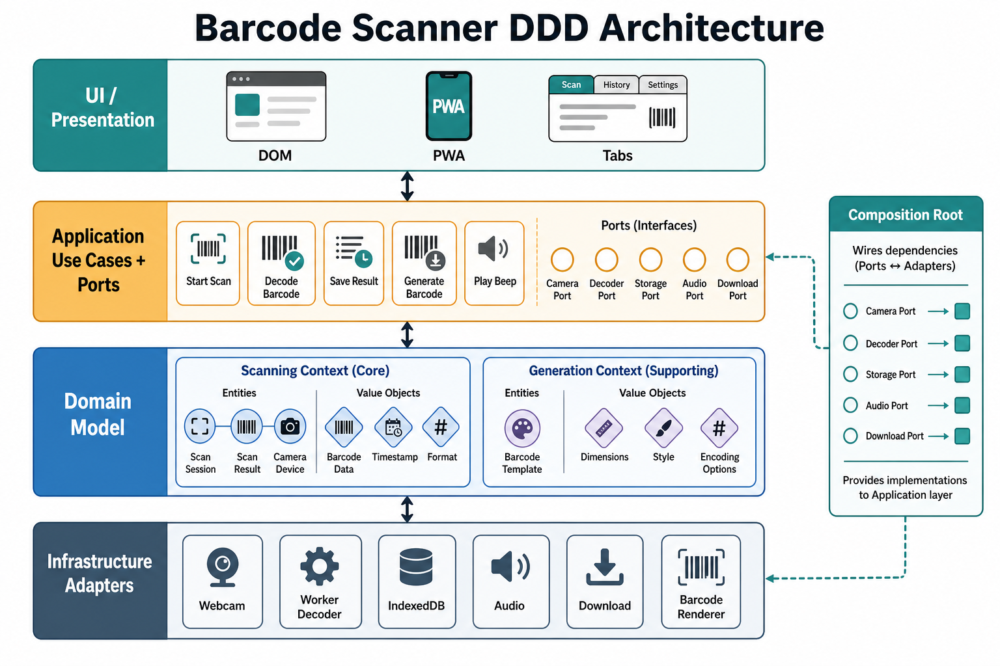

# Barcode Scanner DDD 架構設計文件

狀態：草案  
日期：2026-07-07  
適用範圍：`barcode-scanner` 前端 PWA、Webcam 掃描、圖片掃描、掃描結果管理、CSV/Clipboard 匯出、條碼/QR Code 產生器



## 1. 目標

本文件定義此專案以 Domain-Driven Design 重新整理後的目標架構。目標不是把所有程式碼一次重寫，而是建立可持續演進的邊界：

- 掃描、產生、匯出、裝置與 UI 各自有明確責任。
- Domain 層只保存業務規則，不依賴 DOM、IndexedDB、Web Worker、RxJS 或第三方 UI/API。
- Application 層負責 use case 編排，透過 ports 依賴外部能力。
- Infrastructure 層實作瀏覽器、Webcam、Worker、IndexedDB、音效、下載等 adapter。
- UI 層只處理 DOM 狀態與互動事件，避免承載掃描與匯出規則。

## 2. 目前系統概觀

專案目前是 Vite + TypeScript PWA，主要能力如下：

- Webcam 即時掃描：透過 camera frame、worker decoder 與去重策略建立掃描紀錄。
- 圖片貼上/拖放掃描：讀取圖片、前處理、解碼並寫入掃描紀錄。
- 掃描結果管理：保存掃描歷史、更新表格、顯示最後一次掃描。
- 匯出：複製掃描值到 clipboard，或匯出 CSV。
- 條碼/QR Code 產生：根據格式、顏色、邊界、糾錯等設定產生預覽與下載檔。
- PWA：支援離線快取、安裝與 service worker。

現有程式已經有 DDD/Hexagonal 雛形，例如：

- `src/domain/scanning/*`：`BarcodeData`、`ScanRecord`、`ScanHistory`、`DuplicateFilterStrategy`
- `src/application/scanning/*`：`WebcamScannerAppService`、`ExportAppService`
- `src/infrastructure/*`：Webcam、decoder、persistence、audio、generation adapter
- `src/composition-root.ts`：集中組裝 service 與 adapter
- `src/ui/*`：DOM 綁定與使用者互動

## 3. Bounded Context

### 3.1 Scanning Context（核心領域）

責任：

- 表達「一次有效掃描」與「掃描歷史」。
- 執行掃描結果正規化、去重與新增歷史。
- 發出掃描新增、歷史清空等 domain event。
- 為 webcam 掃描與圖片掃描提供一致的 ingestion 規則。

核心模型：

| 名稱 | 類型 | 說明 |
| --- | --- | --- |
| `BarcodeData` | Value Object | 條碼內容與格式；相同 text + format 視為相同條碼資料。 |
| `ScanRecord` | Entity | 一次被接受的掃描事件；有 `id`、`timestamp`、`barcode`。 |
| `ScanHistory` | Aggregate Root | 管理掃描紀錄集合，負責新增、清空、讀取與事件發送。 |
| `DuplicateFilterStrategy` | Domain Service / Policy | 判斷指定冷卻時間內的相同條碼是否應被視為重複。 |
| `ScanRecordAddedEvent` | Domain Event | 新紀錄被接受後發出。 |
| `ScanHistoryClearedEvent` | Domain Event | 歷史被清空後發出。 |

主要 invariants：

- `BarcodeData.text` 不可為空字串。
- 一筆 `ScanRecord` 必須有唯一識別與建立時間。
- 掃描歷史由新到舊呈現。
- 若去重功能開啟，相同 `BarcodeData` 在 cooldown 內不得重複新增。
- 匯出與顯示只能讀取已被 domain 接受的紀錄。

### 3.2 Generation Context（支援領域）

責任：

- 管理 QR Code 與一維條碼產生設定。
- 正規化使用者輸入的格式、顏色、邊界、糾錯等參數。
- 決定下載 mime type、預設檔名、預覽文字與 renderer options。

核心模型：

| 名稱 | 類型 | 說明 |
| --- | --- | --- |
| `GeneratorConfig` | Value Object / DTO | 條碼產生設定。 |
| `BarcodeFormat` | Domain Type | 支援的產生格式，例如 `QR`、`CODE128`。 |
| `DownloadFormat` | Domain Type | `png`、`jpeg`、`svg`。 |
| `normalizeGeneratorConfig` | Domain Policy | 將 UI 輸入修正為合法設定。 |
| `barcodeDownloadFilename` | Domain Policy | 根據格式與時間建立下載檔名。 |

主要 invariants：

- 格式必須屬於允許清單。
- margin 必須落在合法範圍。
- QR 糾錯等級必須合法。
- 下載尺寸與格式必須合法。

### 3.3 Presentation Context（介面層）

責任：

- DOM refs、tab、toast、表格、按鈕、控制項、視覺狀態。
- 將使用者事件轉成 application service 呼叫。
- 訂閱 repository 或 app state，更新畫面。

不應承擔：

- 掃描去重規則。
- CSV 格式規則。
- IndexedDB 存取。
- Web Worker 通訊細節。
- 條碼產生設定驗證規則。

### 3.4 Device & Browser Infrastructure Context（外部能力）

責任：

- Webcam stream、MediaTrack capabilities、torch、zoom。
- Barcode detector / worker decoder。
- IndexedDB persistence。
- Clipboard、download、audio feedback。
- PWA service worker 與瀏覽器能力整合。

這些能力都應透過 application ports 被呼叫，不應反向污染 domain。

## 4. 通用語言（Ubiquitous Language）

| 詞彙 | 定義 | 程式對照 |
| --- | --- | --- |
| 條碼資料 | 解碼後的內容與格式，不包含時間與 UI 狀態。 | `BarcodeData` |
| 掃描紀錄 | 被系統接受的一次掃描事件。 | `ScanRecord` |
| 掃描歷史 | 掃描紀錄集合，也是結果表格與匯出的資料來源。 | `ScanHistory` |
| 解碼 | 將 frame 或圖片轉成候選條碼資料。 | `DecoderAdapter`、`scanImageBlob` |
| 候選結果 | detector 找到但尚未被去重/正規化接受的資料。 | `ScanResult` |
| 去重策略 | 判斷同一條碼在冷卻時間內是否重複。 | `DuplicateFilterStrategy` |
| 匯出 | 將掃描歷史輸出到 clipboard 或 CSV。 | `ExportAppService` |
| 產生設定 | QR/條碼產生器的格式與外觀設定。 | `GeneratorConfig` |
| adapter | 封裝外部 API 或副作用的 infrastructure 實作。 | `*Adapter` |
| composition root | 建立具體依賴並注入 application service 的唯一位置。 | `src/composition-root.ts` |

## 5. 分層規則

目標依賴方向：

```text
UI -> Application -> Domain
UI -> Composition Root -> Infrastructure
Infrastructure -> Domain
Composition Root -> Application + Infrastructure
```

禁止依賴：

- `domain` 不可 import `ui`、`application`、`infrastructure`、DOM、browser API、RxJS。
- `application` 不可依賴 infrastructure 的具體 class；只能依賴 port/interface。
- `ui` 不可直接實作 domain rule；只能呼叫 application service 或讀取 presentation DTO。
- `infrastructure` 不可決定業務規則；只能負責外部 API、資料轉換與技術錯誤處理。

允許依賴：

- `infrastructure` 可建立 domain entity/value object，因為它要把外部資料還原成 domain model。
- `composition-root.ts` 可 import 任何具體實作，因為它是依賴組裝點。
- `ui` 可 import `composition-root.ts` 暫時取得 service；長期可改為更明確的 bootstrap 注入。

## 6. 目標架構圖（文字版）

```text
                 Browser / User
                      |
                      v
              src/ui/* (DOM, events)
                      |
                      v
        src/application/* (use cases, ports)
          |            |             |
          v            v             v
 src/domain/scanning  src/domain/generation  domain events
          ^
          |
 src/infrastructure/* (adapters)
   - WebcamStreamAdapter
   - DecoderAdapter / Worker
   - IndexedDbScanRepository
   - AudioAdapter
   - Download / Clipboard
   - Barcode renderer
```

## 7. 建議目標目錄

```text
src/
  composition-root.ts
  main.ts

  domain/
    scanning/
      BarcodeData.ts
      ScanRecord.ts
      ScanHistory.ts
      DuplicateFilterStrategy.ts
      ScanEvents.ts
      ScanExportPolicy.ts
    generation/
      BarcodeGenerationConfig.ts
      BarcodeGenerationPolicy.ts
    shared/
      DomainEvent.ts

  application/
    scanning/
      ports/
        BarcodeDecoderPort.ts
        FrameSourcePort.ts
        ScanRepositoryPort.ts
        AudioFeedbackPort.ts
        ClockPort.ts
        DownloadPort.ts
        ClipboardPort.ts
      use-cases/
        StartWebcamScanning.ts
        StopWebcamScanning.ts
        IngestScanResult.ts
        ScanImage.ts
        ExportScans.ts
        ClearScanHistory.ts
      dto/
        ScanViewModel.ts
    generation/
      ports/
        BarcodeRendererPort.ts
        FileDownloadPort.ts
      use-cases/
        RenderBarcodePreview.ts
        DownloadGeneratedBarcode.ts

  infrastructure/
    scanning/
      WebcamStreamAdapter.ts
      DecoderAdapter.ts
      DecoderWorker.ts
      ImageScannerAdapter.ts
    persistence/
      IndexedDbScanRepository.ts
      InMemoryScanRepository.ts
    audio/
      AudioAdapter.ts
    browser/
      BrowserClipboardAdapter.ts
      BrowserDownloadAdapter.ts
      image-file-loader.ts
    generation/
      BarcodeRendererAdapter.ts
      BarcodeDownloadAdapter.ts

  ui/
    scanner-ui.ts
    paste-ui.ts
    results-ui.ts
    generator-ui.ts
```

## 8. Application Ports

目前部分 application service 仍直接依賴 infrastructure class。DDD/Hexagonal 目標是把這些依賴改為 ports。

### 8.1 Scanning ports

```ts
export interface BarcodeDecoderPort {
  decode(frame: ImageBitmap): Promise<DecodeResult>;
  destroy(): void;
}

export interface WebcamFrameSourcePort {
  requestStream(video: HTMLVideoElement): Promise<MediaStream>;
  getFrameStream(): Observable<ImageBitmap>;
  getCapabilities(): MediaTrackCapabilities | null;
  applyConstraint(constraints: MediaTrackConstraints): Promise<void>;
  stop(): void;
}

export interface ScanRepositoryPort {
  init(): Promise<void>;
  save(record: ScanRecord): Promise<void> | void;
  getAll(): ReadonlyArray<ScanRecord>;
  clear(): Promise<void> | void;
  subscribe(listener: () => void): () => void;
  readonly count: number;
}

export interface AudioFeedbackPort {
  playSuccessSound(): void;
}
```

### 8.2 Export ports

```ts
export interface ClipboardPort {
  writeText(text: string): Promise<void>;
}

export interface DownloadPort {
  downloadText(content: string, mimeType: string, filename: string): void;
}
```

### 8.3 Generation ports

```ts
export interface BarcodeRendererPort {
  renderPreview(target: HTMLCanvasElement, text: string, config: GeneratorConfig): Promise<void>;
  renderOutput(target: HTMLCanvasElement, text: string, config: GeneratorConfig): Promise<void>;
  renderSvg(text: string, config: GeneratorConfig): Promise<string>;
}

export interface GeneratedBarcodeDownloadPort {
  downloadCanvas(canvas: HTMLCanvasElement, config: GeneratorConfig): void;
  downloadSvg(svg: string, config: GeneratorConfig): void;
}
```

## 9. Use Case 設計

### 9.1 Start Webcam Scanning

輸入：

- `HTMLVideoElement`
- 去重設定
- 音效設定

流程：

1. 取得 webcam stream。
2. 建立 frame stream。
3. 節流 frame decode。
4. 呼叫 decoder port。
5. 將解碼結果轉成 `BarcodeData`。
6. 套用 `DuplicateFilterStrategy`。
7. 建立 `ScanRecord`。
8. 儲存到 `ScanRepositoryPort`。
9. 播放成功音效。
10. 發出 state 或 domain event，讓 UI 更新。

輸出：

- scanner state：active/error/capabilities。
- 掃描歷史更新。

### 9.2 Scan Image

輸入：

- `Blob` 或 `File`
- 去重設定

流程：

1. 將圖片交給 image scanner adapter。
2. 取得候選結果。
3. 正規化條碼文字與格式。
4. 與歷史最新紀錄套用去重策略。
5. 接受後建立 `ScanRecord` 並保存。
6. 回傳新增數與重複數。

### 9.3 Export Scans

輸入：

- 掃描歷史。
- 匯出目標：clipboard 或 CSV。

流程：

1. 從 repository 讀取 `ScanRecord[]`。
2. 透過 domain export policy 產生文字或 CSV。
3. 透過 clipboard/download port 執行副作用。

### 9.4 Generate Barcode

輸入：

- 使用者文字。
- `GeneratorConfig`。
- 下載格式。

流程：

1. 正規化設定。
2. 根據格式選擇 QR 或一維條碼 renderer。
3. 產生 preview 或 output。
4. 若下載，透過 download port 輸出指定格式。

## 10. 目前程式對照表

| 目標層 | 現有檔案 | 狀態 |
| --- | --- | --- |
| Domain / Scanning | `src/domain/scanning/BarcodeData.ts` | 已符合 Value Object 方向。 |
| Domain / Scanning | `src/domain/scanning/ScanRecord.ts` | 已符合 Entity 方向；可補 clock/id port 以利測試。 |
| Domain / Scanning | `src/domain/scanning/ScanHistory.ts` | 已具 Aggregate Root；可補 remove/update 規則。 |
| Domain / Scanning | `src/domain/scanning/DuplicateFilterStrategy.ts` | 已是可測的 domain policy。 |
| Domain / Scanning | `src/domain/scanning/scan-result.ts` | 純函式可保留，但可拆成 candidate result policy。 |
| Domain / Generation | `src/domain/generation/barcode-generation.ts` | 已有設定正規化與下載命名規則。 |
| Application / Scanning | `src/application/scanning/WebcamScannerAppService.ts` | use case 已集中，但仍依賴具體 infrastructure class。 |
| Application / Export | `src/application/scanning/ExportAppService.ts` | 已集中匯出流程，但 clipboard/download 應改走 ports。 |
| Infrastructure / Scanning | `src/infrastructure/scanning/*` | adapter 方向正確。 |
| Infrastructure / Persistence | `src/infrastructure/persistence/*` | repository 實作方向正確；interface 建議搬到 application port。 |
| Infrastructure / Generation | `src/infrastructure/generation/*` | renderer/download adapter 方向正確。 |
| UI | `src/ui/*` | 已逐步轉成 presentation 層，但仍有少量 domain/infrastructure 邏輯殘留。 |
| Composition | `src/composition-root.ts` | 依賴組裝點方向正確。 |

## 11. 重構路線

### Phase 0：穩定基線

- 確認目前 TypeScript、ESLint、build 可通過。
- 修正任何 encoding/mojibake 造成的字串或 syntax 問題。
- 保留現有功能行為，不做架構擴張。
- 對 `DuplicateFilterStrategy`、`barcode-generation`、CSV policy 建立 domain tests。

### Phase 1：抽出 ports

- 將 `IScanRepository` 從 `IndexedDbScanRepository.ts` 移到 `src/application/scanning/ports/ScanRepositoryPort.ts`。
- 新增 `BarcodeDecoderPort`、`AudioFeedbackPort`、`ClipboardPort`、`DownloadPort`。
- `WebcamScannerAppService` 與 `ExportAppService` 只 import ports 與 domain。

### Phase 2：掃描 ingestion 統一

- 建立 `IngestScanResult` use case。
- Webcam 與圖片掃描都透過同一個 use case 新增紀錄。
- 去重設定、clock、id 產生策略集中處理。

### Phase 3：匯出規則 domain 化

- 將 CSV header、BOM、filename、cell escape 規則整理成 `ScanExportPolicy`。
- `ExportAppService` 只負責讀取 repository 與呼叫外部 port。
- UI 不直接碰 CSV 字串。

### Phase 4：產生器 application service

- 建立 `BarcodeGeneratorAppService`。
- `generator-ui.ts` 只讀取 UI controls 並呼叫 application service。
- renderer 與 download 放在 infrastructure adapters。

### Phase 5：事件與 state 邊界

- 移除全域 static `DomainEvents`，讓 repository 在資料變更後自行通知 subscribers。
- UI 訂閱 application state 或 repository subscription，不直接在 module load 時綁 domain event。

### Phase 6：測試策略補齊

- Domain tests：Value Object、Aggregate、Policy、CSV。
- Application tests：以 fake ports 測 use case flow。
- Infrastructure smoke tests：IndexedDB repository、decoder worker 的基本 contract。
- UI smoke tests：啟動、tab 切換、圖片掃描、CSV 匯出、產生器互動。

## 12. 測試策略

| 測試層級 | 目標 | 工具 |
| --- | --- | --- |
| Domain unit tests | 業務規則穩定且快速驗證。 | Vitest |
| Application use-case tests | 驗證 ports 被正確呼叫與 state 轉換。 | Vitest + fake ports |
| Infrastructure contract tests | 驗證 adapter 轉換外部資料的 contract。 | Vitest / browser-like env |
| UI smoke tests | 驗證主要互動沒有斷。 | Playwright 或手動 smoke |
| Build checks | 確保型別與 bundling 可通過。 | `npm run lint`、`npm run type-check`、`npm run build` |

## 13. Definition of Done

DDD 重構階段完成時，至少應滿足：

- `domain` 沒有 browser API、DOM、RxJS、IndexedDB、worker import。
- `application` 只依賴 domain 與 ports。
- 所有 infrastructure class 都由 `composition-root.ts` 組裝。
- Webcam 掃描與圖片掃描共用 ingestion use case。
- CSV 與 clipboard/export 行為由 application service 觸發，不在 UI 組字串。
- 條碼產生設定的合法化由 domain policy 控制。
- `src/core/*` 已移除，legacy helper 已移到 domain 或 infrastructure。
- `npm run lint`、`npm run type-check`、`npm run test`、`npm run test:e2e`、`npm run build` 通過。

## 14. 架構決策紀錄

### ADR-001：以 Scanning Context 作為核心領域

掃描流程包含硬體、影像、去重、歷史、匯出與使用者回饋，是此產品的核心價值。DDD 優先保護 Scanning Context，讓外部技術替換不影響掃描規則。

### ADR-002：Generation Context 作為支援領域

條碼/QR Code 產生器很重要，但與掃描歷史生命週期不同。它應保有自己的設定規則與 renderer ports，不應與 Scanning Context 混成同一個 service。

### ADR-003：Composition Root 集中在 `src/composition-root.ts`

瀏覽器專案沒有後端 DI container，因此用 composition root 集中建立具體 adapter 與 application service。UI 不直接 new infrastructure class。

### ADR-004：先穩定 ports，再移動檔案

DDD 重構的風險通常來自大規模搬檔。建議先定義 ports 與 tests，確定依賴方向，再逐步調整資料夾。

## 15. 完成狀態

原先的後續優先清單已完成：

1. 基線已通過 lint、type-check、unit tests、Playwright smoke test 與 build。
2. `IScanRepository` 已改為 application port：`ScanRepositoryPort`。
3. `BarcodeDecoderPort`、`AudioFeedbackPort`、`WebcamFrameSourcePort` 等 ports 已建立，`WebcamScannerAppService` 不再依賴具體 adapter。
4. `IngestScanResultUseCase` 已建立，webcam 與 paste/drop 共用同一套去重與保存流程。
5. `ExportAppService` 已改為 domain export policy + clipboard/download ports。
6. `BarcodeGeneratorAppService` 已建立，`generator-ui.ts` 只保留 UI controls 與 render target 管理。
7. static `DomainEvents` 已移除。
8. legacy `src/core/*` 已清理。
9. Playwright smoke test 已補上。
